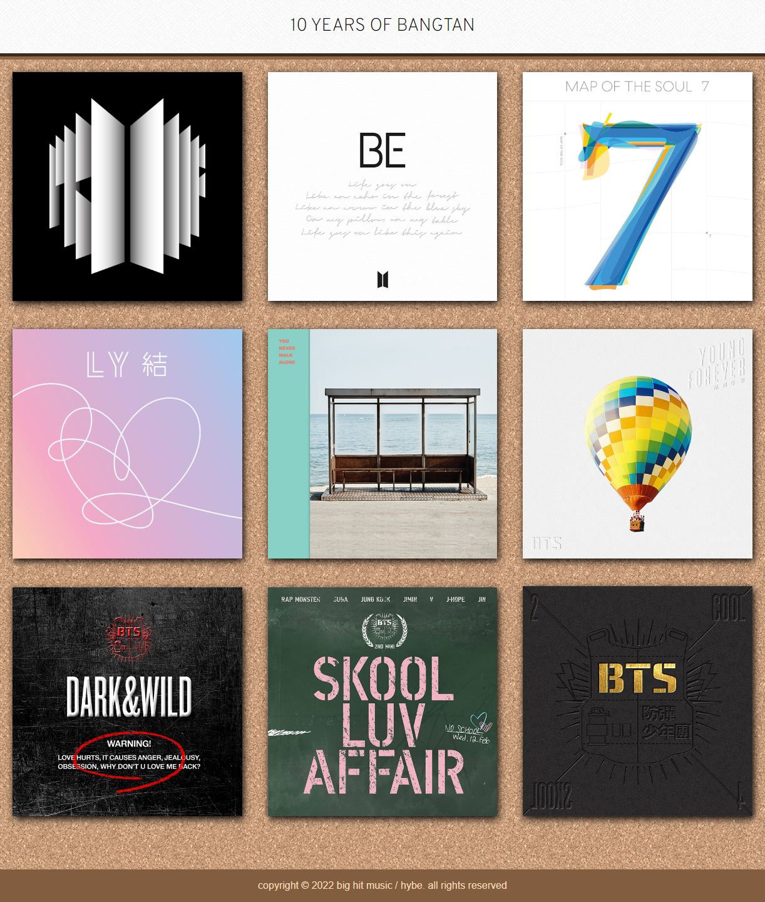

# aesthetic-discography
> Deployed with GitHub Pages 🔗https://cyphernyx.github.io/aesthetic-discography/

## About the Project
This project features a grid layout page showcasing album covers from a beloved music artist's discography. It's a visual journey that complements the auditory experience, giving fans a delightful way to explore this artist's most relevant albums.

## Contributing
Pull requests are welcome. Please open an issue first to discuss any proposed changes or additions.
 

## License 

  
  https://opensource.org/licenses/MIT   
  This project is open source and available under the MIT License.

 

## Attributions 

### Background Images
- The background images used in this project were sourced from [Toptal](https://www.toptal.com/designers/subtlepatterns/).
[Cork Board Pattern](https://www.toptal.com/designers/subtlepatterns/cork-board-pattern/) Made by Lopez Théo, and [Greyzz Pattern](https://www.toptal.com/designers/subtlepatterns/greyzz/) Made by Infographiste

### Album Images
- The album cover images are copyrighted material owned by the respective music label of the artist (BTS). All rights and copyrights to these album images are held by the music label. They are used in this project for educational and informational purposes, and their use should be in compliance with copyright laws and regulations.

## Questions
  GitHub [CypherNyx](https://github.com/CypherNyx) 
  Email: dguido.dev@gmail.com